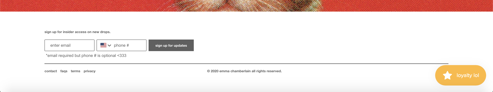
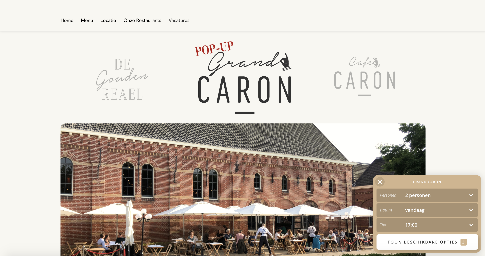
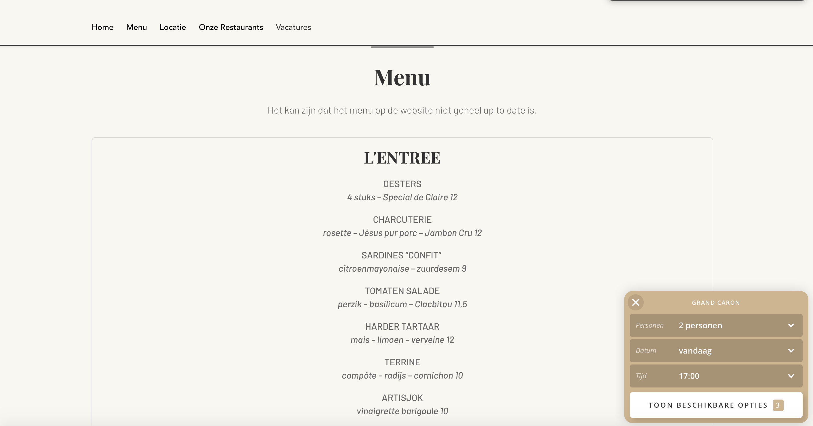
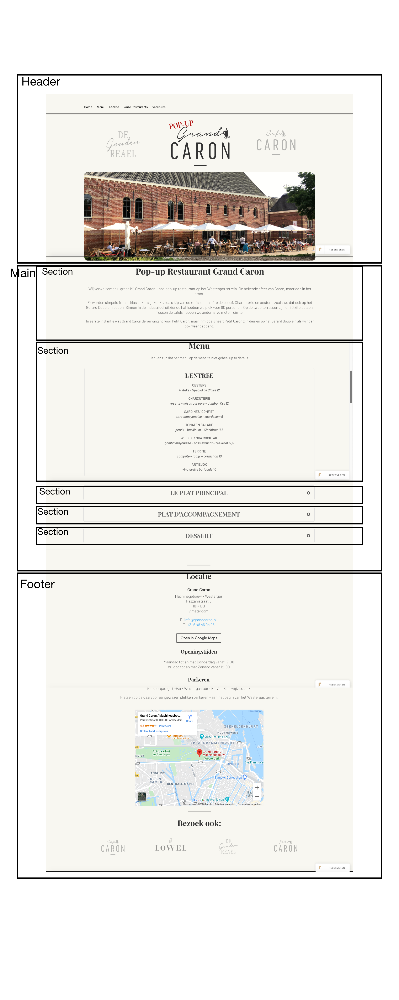
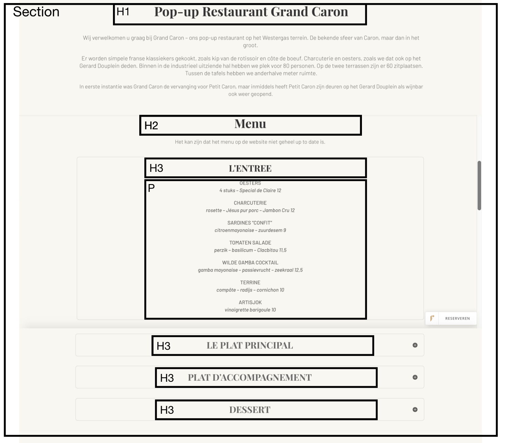

# Procesverslag
**Auteur:** -Bo ten Haaf-

Markdown cheat cheet: [Hulp bij het schrijven van Markdown](https://github.com/adam-p/markdown-here/wiki/Markdown-Cheatsheet). Nb. de standaardstructuur en de spartaanse opmaak zijn helemaal prima. Het gaat om de inhoud van je procesverslag. Besteedt de tijd voor pracht en praal aan je website.

## Bronnenlijst
1. -bron 1-
2. -bron 2-
3. -...-

## Eindgesprek (week 7/8)

-dit ging goed & dit was lastig-

**Screenshot(s):**

-screenshot(s) van je eindresultaat-

## Voortgang 3 (week 6)

Deze week heb ik veel aan mijn website gewerkt. 
Mijn website was paar dagen under construction dus moest ik even wat dingen veranderen.
Deze week is het mij eindelijk gelukt om mijn navigatie balk responsive te krijgen. Dit is best wel goed gelukt, alleen sommige kleine dingetjes moeten nog gefixt worden.
Ook heb ik bepaalde knoppen een animatie gegeven zodat ze bijvoorbeeld een andere kleur worden.

Ik wil graag dat mijn hele website responsive wordt maar ik vind dit best wel lastig. Want tot nu toe staat alles schreef als je het op een telefoon formaat uitprobeerd. Ik ga hier veel hulp bij zoeken en veel vragen stellen in de les als we daar tijd voor hebben. 

## Voortgang 2 (week 5)
In week 5 heb ik besloten om helemaal opnieuw teb beginnen. Ik merkte dat ik er geen zin in kreeg om mijn website af te maken. Toen heb ik gekozen voor een nieuwe website en nu heb ik er weer helemaal zin in.
Dit is de website die ik nu ga "namaken"

https://shopemmachamberlain.com/

## Voortgang 1 (week 3)

### Stand van zaken

Ik vond het best wel lastig om te beginnen met dit vak, dit omdat wij best veel te doen hadden de eerste weken en hierdoor zette ik dit vak eigenlijk een beetje op zij. Maar nu heb ik mijzelf wel een duwtje in mijn rug gegeven want ik wist wel dat dit vak best lastig zou worden. Ik ben nu maar op een klein stukje van mijn website, maar dit wilde ik perfectioneren waardoor ik hier best lang aan heb gezeten want ik heb ook lang niet gecodeerd dus dit was eventjes wennen. 
Voor de rest gaan de lessen allemaal wel goed thuis, doordat we met kleinere groepjes werken is er veel meer aandacht voor specifieke vragen en dit vind ik erg fijn.

**Screenshot(s):**

### Agenda voor meeting
-s

### Verslag van meeting

## Intake (week 1)

**Je startniveau:** blauw

**Je focus:** surface plane

**Je opdracht:** https://shopemmachamberlain.com/
**Screenshot(s):**

**Breakdown-schets(en):**

